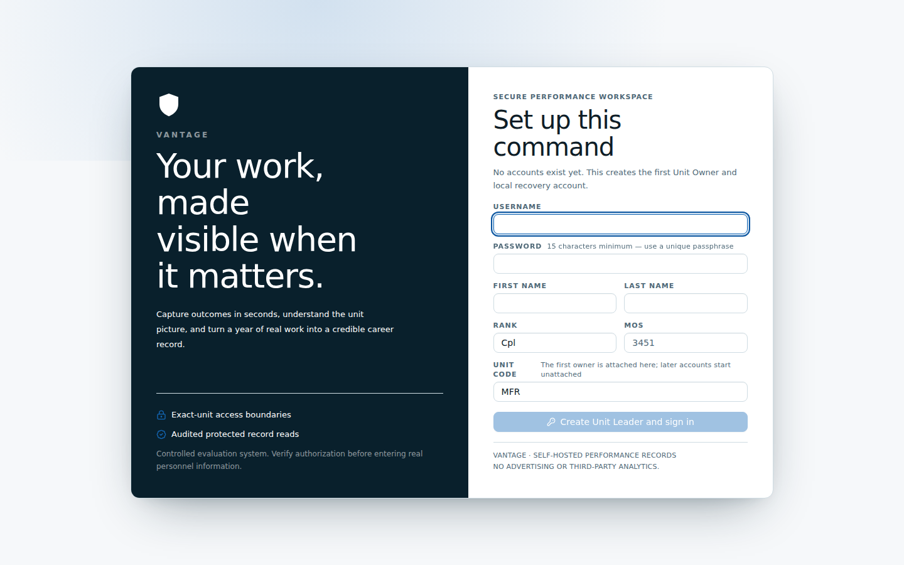
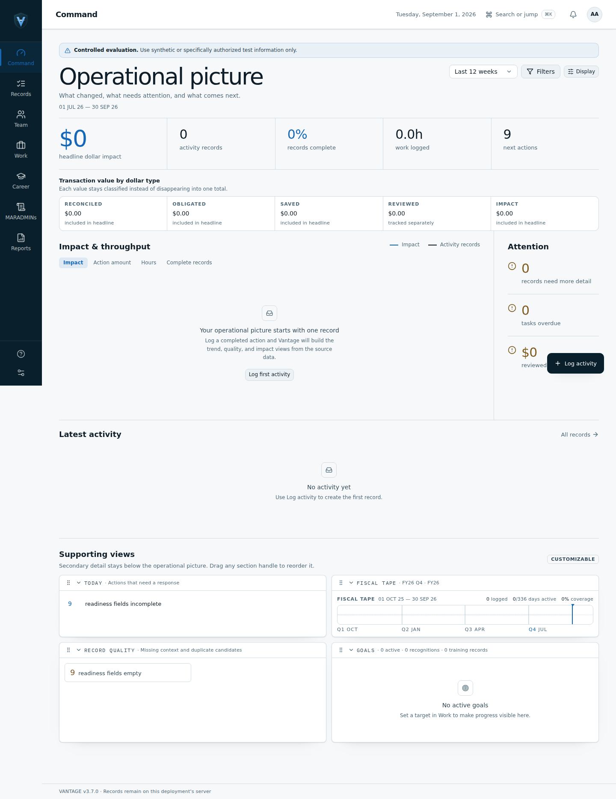
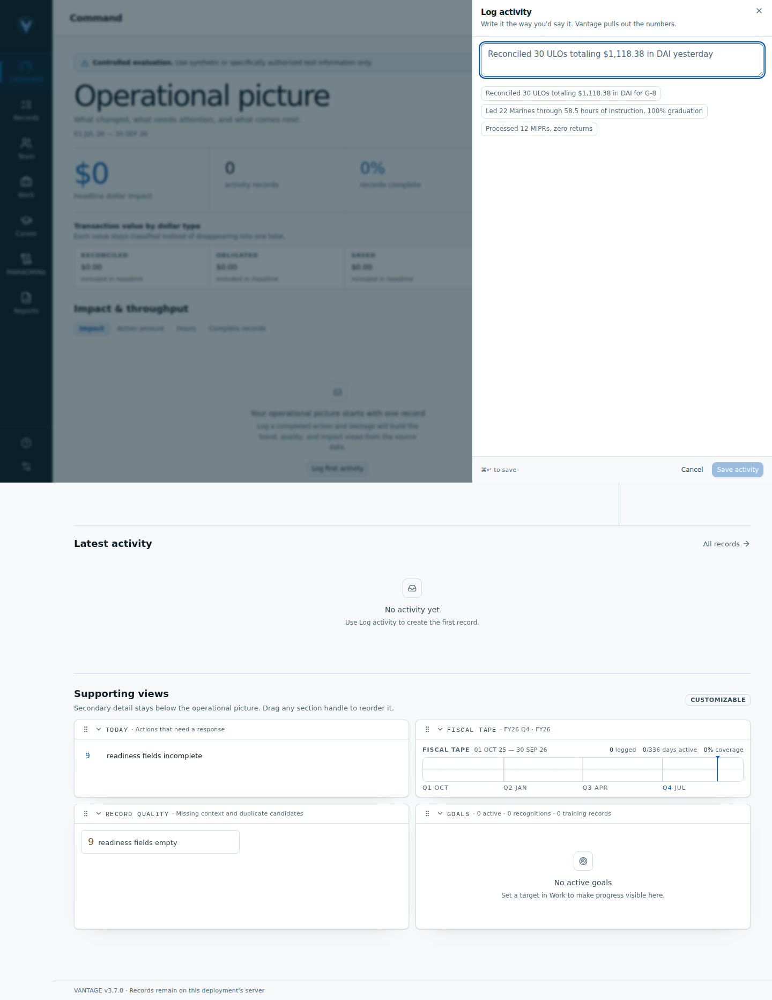
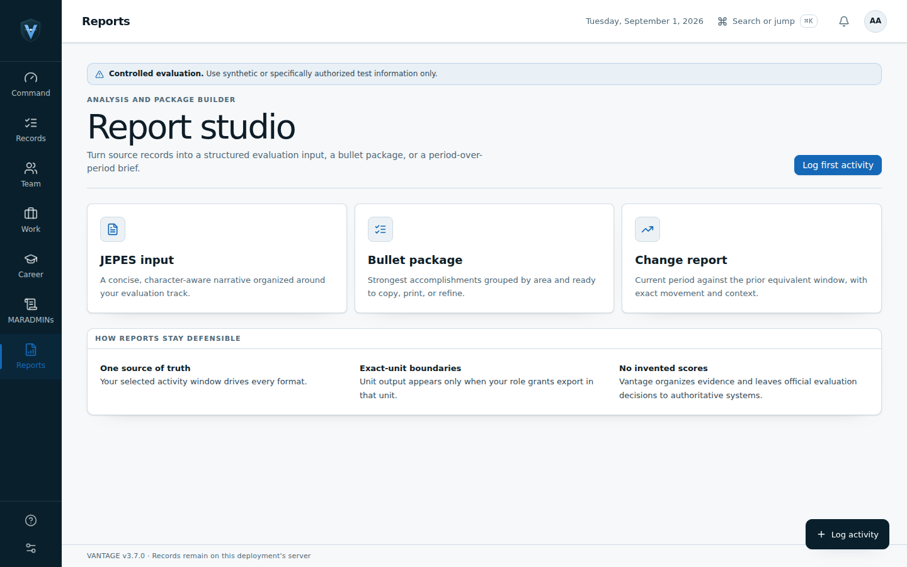
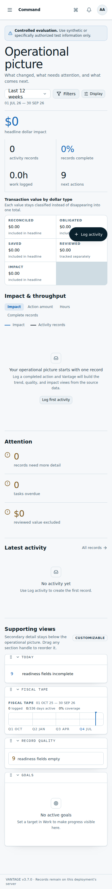
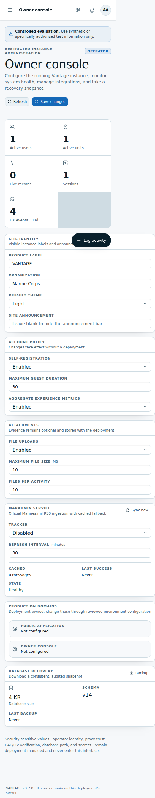

# VANTAGE WCAG 2.2 AA gap audit

**Audit date:** 2026-09-01  
**Audited branch:** `audit/wcag-2-2-evidence`  
**Audited build:** `ff14562f21f6b91f195dfe5939fd6924061e0548`  
**Evidence run:** [GitHub Actions run 33541640858](https://github.com/jbbmans/vantage/actions/runs/33541640858)

## Verdict

VANTAGE is **not ready for a WCAG 2.2 AA conformance claim**. This audit confirmed two release-blocking accessibility defects:

1. The active desktop navigation label has a 2.7:1 contrast ratio on nine routed views; normal-sized text requires 4.5:1.
2. The Owner Console overflows horizontally by 147 CSS pixels at a 375-pixel viewport.

The audit also found two material risks that should be corrected and regression-tested: the fixed mobile Quick Log action obscures page content, and the Quick Log textarea relies on disappearing placeholder text rather than a persistent visible label.

This is an evidence-backed conformance **gap audit**, not an accessibility certification. Automated tools cannot verify every WCAG success criterion or substitute for keyboard and assistive-technology testing by disabled users.

## Audit scope and method

- Ran a clean synthetic VANTAGE instance on GitHub-hosted Ubuntu with Node 22, Chromium 151, Playwright, and `@axe-core/playwright`.
- Captured and manually inspected six screens: setup, Command Center desktop, Quick Log, Report Studio, Command Center mobile, and Owner Console mobile.
- Scanned 14 routed views with axe for serious and critical violations: setup/login, Command Center, Records, Work, Goals, Career, Readiness, MARADMINs, Reports, Team, Units, Settings, Owner Console, and Field Guide.
- Tested all 13 signed-in routes for horizontal reflow at 375 and 768 CSS pixels.
- Recorded the first 12 mobile keyboard focus stops on Command Center.
- Used synthetic data only. No production or personnel data entered the runner.
- Captures used the light/device-matched theme and reduced-motion preference. Dark theme, compact density, forced-colors mode, populated charts, error states, 200%/400% zoom, and screen-reader output remain outside this pass.

## Confirmed findings

| ID | Priority | WCAG 2.2 | Finding | Evidence | Required correction |
|---|---|---|---|---|---|
| A11Y-01 | P1 | 1.4.3 Contrast (Minimum) | Active desktop navigation text is `#1468b7` on `#0a273a`, a 2.7:1 ratio instead of 4.5:1. The shared defect affects Command Center, Records, Work, Goals, Career, Readiness, MARADMINs, Reports, and Team. | Steps 2–4; all-route axe scan. Shared active style is defined in [`AppShell.jsx` lines 151–188](https://github.com/jbbmans/vantage/blob/ff14562f21f6b91f195dfe5939fd6924061e0548/src/components/AppShell.jsx#L151-L188). | Keep the signal indicator/icon if desired, but use a text token that reaches at least 4.5:1 on the nav surface. Add a regression assertion for every active route in both themes. |
| A11Y-02 | P1 | 1.4.10 Reflow | Owner Console is 522 pixels wide in the 390-pixel capture and overflows by 147 pixels in the automated 375-pixel test. Users must pan horizontally to reach content. | Step 6; 375-pixel reflow test. Likely hotspots are the metric/config grids in [`OperatorConsole.jsx` lines 100–139](https://github.com/jbbmans/vantage/blob/ff14562f21f6b91f195dfe5939fd6924061e0548/src/pages/OperatorConsole.jsx#L100-L139) and panel headers in [`primitives.jsx` lines 194–207](https://github.com/jbbmans/vantage/blob/ff14562f21f6b91f195dfe5939fd6924061e0548/src/components/ui/primitives.jsx#L194-L207). | Identify the overflowing descendant with bounding-box diagnostics, apply `min-width: 0`/wrapping at the responsible grid or header, and retest at 320, 375, and 400 CSS pixels plus 400% zoom. |
| A11Y-03 | P2 | 1.4.10 Reflow; 2.4.11 Focus Not Obscured (Minimum) risk | The fixed mobile “Log activity” action visibly covers the OBLIGATED transaction tile and overlaps Owner Console content. The capture does not prove a focused control is hidden, so 2.4.11 is a risk rather than a confirmed failure. | Steps 5–6. The fixed positioning is in [`AppShell.jsx` lines 466–473](https://github.com/jbbmans/vantage/blob/ff14562f21f6b91f195dfe5939fd6924061e0548/src/components/AppShell.jsx#L466-L473). | Reserve sufficient bottom/right space, make the action context-aware, or place it in a non-obscuring sticky region. Add a test that no focusable or informative element intersects the action at narrow widths. |
| A11Y-04 | P2 | 3.3.2 Labels or Instructions risk | Quick Log has no persistent visible label for its primary textarea. Its placeholder disappears when the user types, weakening instructions and error recovery. Axe did not flag this, so it is a manual-review finding. | Step 3. The textarea is rendered with placeholder text only in [`QuickLog.jsx` lines 117–145](https://github.com/jbbmans/vantage/blob/ff14562f21f6b91f195dfe5939fd6924061e0548/src/components/QuickLog.jsx#L117-L145); the shared textarea primitive adds no label in [`primitives.jsx` lines 54–55](https://github.com/jbbmans/vantage/blob/ff14562f21f6b91f195dfe5939fd6924061e0548/src/components/ui/primitives.jsx#L54-L55). | Add a persistent visible label such as “Describe the completed activity,” associate it programmatically, and retain the example as hint text or placeholder. |

## Confirmed strengths

- Setup produced no automated violations in the selected WCAG A/AA rule set and presents visible field labels and a strong focus indicator (Step 1).
- The first 12 Command Center mobile focus stops were logical: menu, search, notifications, account, period/filter/display controls, then linked headline metrics.
- Focus indicators are globally defined and visually apparent in the setup and Quick Log captures; see [`index.css` lines 129–133 and 180–193](https://github.com/jbbmans/vantage/blob/ff14562f21f6b91f195dfe5939fd6924061e0548/src/styles/index.css#L129-L193).
- Reduced-motion handling disables smooth scrolling and effectively removes animations/transitions; see [`index.css` lines 325–333](https://github.com/jbbmans/vantage/blob/ff14562f21f6b91f195dfe5939fd6924061e0548/src/styles/index.css#L325-L333).
- Twelve of thirteen signed-in routes fit at both 375 and 768 CSS pixels. Mobile navigation, notifications, the command menu, and the rank-request dialog also fit and operated in the isolated mobile suite.
- Units, Settings, Owner Console, and Field Guide produced no serious/critical axe violations beyond the separately detected reflow issue.

## Evidence by step

### 1. Initial setup — healthy in captured state

- No automated violations in the selected WCAG A/AA tags.
- Visible labels and strong focus treatment are present.
- The disabled primary action is visually subdued; disabled-control contrast is not evaluated as a WCAG text-contrast failure.

### 2. Command Center desktop — needs correction

- The active “Command” navigation label fails 1.4.3 at 2.7:1.
- Information hierarchy and empty-state messaging remain understandable.

### 3. Quick Log — mixed

- The drawer opens from the `N` shortcut, receives focus, and closes with Escape in the capture flow.
- The textarea has a visible focus ring, but lacks a persistent visible label.
- The background active-nav label retains the shared contrast failure.

### 4. Report Studio — needs correction

- The active “Reports” navigation label fails 1.4.3 at 2.7:1.
- Report choices have clear headings and descriptions in the empty state.

### 5. Command Center mobile — mixed

- No automated violations in this captured state, and the page reflows without horizontal scrolling.
- The floating Quick Log action visibly covers transaction-card content, creating an obscuration risk.
- The first 12 recorded focus stops follow the visible task order.

### 6. Owner Console mobile — fails reflow

- The full-page capture expands to 522 pixels despite a 390-pixel viewport.
- The independent 375-pixel check measured 147 pixels of horizontal overflow.
- Axe reported no serious/critical issue because reflow is not reliably inferred by DOM-only rules; the rendered evidence and viewport measurement establish the defect.

## Verification summary

| Check | Result |
|---|---|
| Audit evidence workflow | Passed; screenshots, JSON, and job artifact created |
| All-route axe scan | 5/14 routes free of serious/critical findings; 9/14 fail the shared active-nav contrast rule |
| Mobile reflow/interaction suite | 32/33 checks pass; Owner Console at 375 pixels fails by 147 pixels |
| `npm run lint` | Passed in release-gate source/API job |
| `npm test` | Passed in release-gate source/API job |
| `npm run build` | Passed in release-gate source/API and audit jobs |
| Full `npm run test:browser` | Did not pass: the broad browser flow stops earlier on the existing Team-transfer “Reassign” locator timeout, before reaching its axe/mobile subtests. The audit therefore ran those accessibility subtests independently. |

## Remaining verification gaps

Before any WCAG 2.2 AA claim, complete:

1. Full keyboard operation and focus restoration for every dialog, popover, drawer, drag/reorder control, and error state.
2. NVDA + Firefox/Chrome and JAWS + Chrome testing on Windows, plus VoiceOver + Safari where mobile support matters.
3. 200% and 400% zoom, text spacing overrides, Windows High Contrast/forced-colors, and both light/dark themes.
4. Comfortable and compact density checks.
5. Populated charts, tables, uploaded-file flows, validation errors, notifications, report export, and administrative destructive-action confirmations.
6. A rerun after A11Y-01 through A11Y-04 are corrected, with `test:browser` repaired so accessibility failures cannot be skipped by an earlier behavioral test.

## Recommended remediation order

1. Fix A11Y-01 and A11Y-02 before release; both are confirmed AA failures.
2. Fix A11Y-03 and A11Y-04 in the same frontend accessibility patch.
3. Separate the accessibility and mobile jobs from the long behavioral browser sequence in permanent CI.
4. Run the manual assistive-technology matrix, then archive a new dated evidence set and conformance statement.
